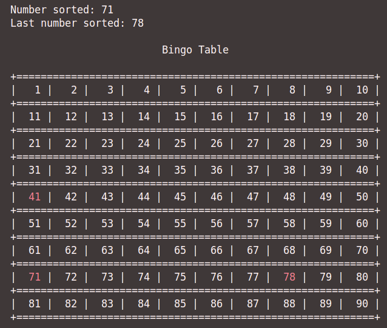
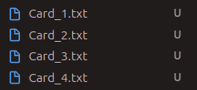
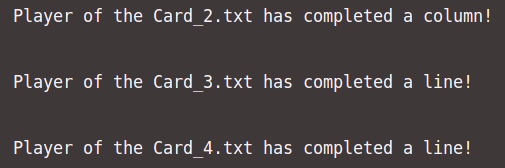

# BINGO

Welcome to the BingoGame repository! This is game developed based on the traditional Bingo game.
You can play with your friends and family, the bingo game is able to generate new cards anytime you want to play.
Here, you will find everything your looking for to know more about this wonderful game.

## 🎮 About the game

Bingo is a game where numbers will be sorted and if that exact number matches the one you have on your card, you're one step closer to winning. The main goal is to fill out your card, depending on the numbers being sorted.

### Main Functionalities

- Function 1 -> Card generator
- Function 2 -> Check winner method
- Function 3 -> 50 / 90 pool
- Function 4 -> Robo voice announcing the numbers
  
## ⚙️ Requirements

1. Install the espeak library:
- Run the following commands on the linux terminal:
    sudo apt update && 
    sudo apt install espeak

- Verify installation:
    espeak --version

## 🖼️ Screenshots

Some screenshots of the game in action:

<table>
  <tr>
    <td align="center">
      
       
      <b>Bingo Pool</b>
    </td>
    <td align="center">
      
       
      <b>Generation of Bingo Cards</b>
    </td>
  </tr>
  <tr>
    <td align="center">
      
       
      <b>Check Winner Method</b>
    </td>
  </tr>
</table>

### Developed by
<table>
  <tr>
    <td align="center">
      <a href="https://github.com/Sousa1302">
         
        <b>Gonçalo Sousa</b>
      </a>
    </td>
    <td align="center">
      <a href="https://github.com/goncalobranco299">
         
        <b>Gonçalo Branco</b>
      </a>
    </td>
  </tr>
</table>

